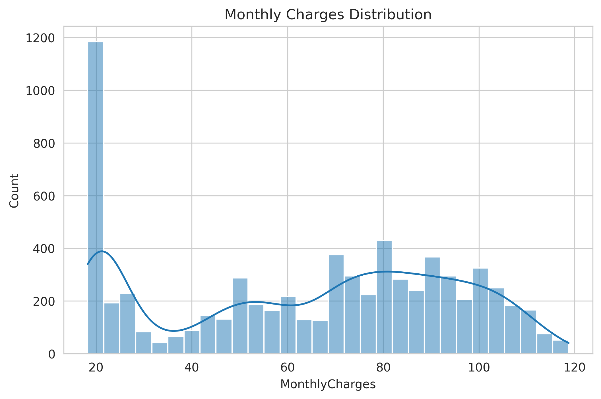
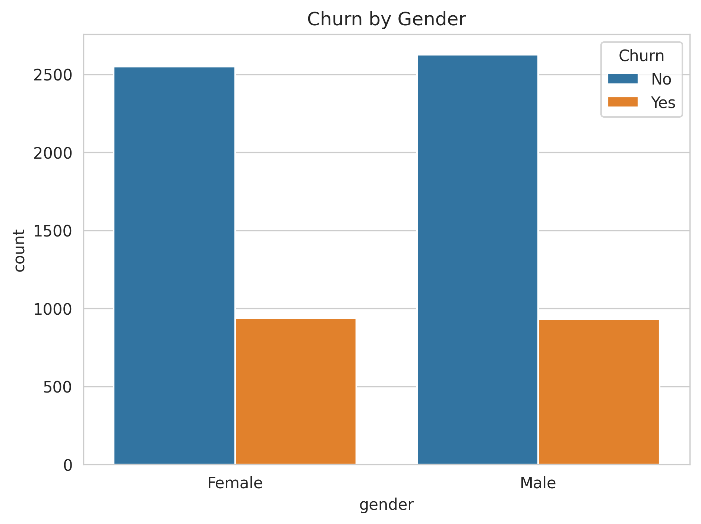
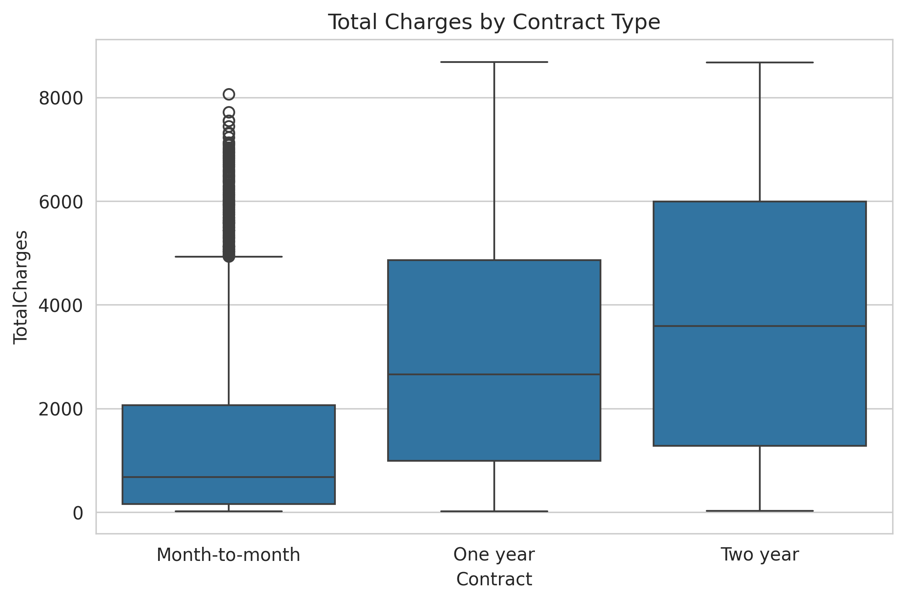

# 📊 Telco Customer Churn — Business Analytics Case Study

**AnalystLab Africa Data Analytics Internship — Week 5, Batch B**

A business analytics case study answering: *why are customers leaving the company, and which factors contribute most to churn?* Built on the [Telco Customer Churn dataset](https://www.kaggle.com/datasets/blastchar/telco-customer-churn) (7,043 customers, 21 variables).

---

## 🎯 Business Problem

The company is losing a significant share of customers to churn. Retention resources are limited, so this analysis identifies **which customer segments and behaviors drive churn**, to help the business prioritize where retention spend will have the greatest impact.

## 🔑 Key Findings

| Driver | Finding |
|---|---|
| **Contract type** | Churn drops from **42.7%** (month-to-month) → 11.3% (one year) → **2.8%** (two year) |
| **Internet service** | Fiber optic customers churn at **41.9%** vs. 19.0% for DSL |
| **Payment method** | Electronic check payers churn at **45.3%**, ~3x the rate of autopay customers |
| **Tenure** | Churned customers average **18 months** tenure vs. 38 months for retained customers |
| **Add-on services** | Customers without online security or tech support churn **2.5–3x** more |
| **Demographics** | Senior citizens (41.7%), and customers without a partner (33.0%) or dependents (31.3%), churn more |

**Overall churn rate: 26.54%** (1,869 of 7,043 customers)

<p align="center">
  
</p>

<p align="center">
  
  
</p>

## 💡 Recommendations

1. Incentivize longer contracts, prioritizing month-to-month customers in their first 12 months
2. Investigate the fiber optic experience — pricing, reliability, competitive positioning
3. Migrate electronic check payers toward automatic payment methods
4. Bundle and proactively promote online security and tech support add-ons
5. Build an early-tenure retention program focused on a customer's first year
6. Tailor retention outreach for senior citizens and single customers without dependents

## 🛠️ Tools & Skills

Python (pandas, numpy, matplotlib, seaborn) · exploratory data analysis · data cleaning · correlation analysis · segment/cross-tab analysis · business insight generation · stakeholder reporting

## 📁 Repository Structure

```
telco-churn-analysis/
├── Scripts/
│   └── churn_analysis.py           # full analysis: cleaning, EDA, charts, tables
├── Reports/
│   ├── Telco_Churn_Case_Study_Report.pdf
│   └── Telco_Churn_Case_Study_Deck.pdf
├── Outputs/
│   ├── Charts/                     # 27 saved PNG visualizations
│   └── Tables/                     # saved CSV tables (summary stats, crosstabs, etc.)
├── Data/
│   └── WA_Fn-UseC_-Telco-Customer-Churn.csv
├── requirements.txt
└── README.md
```

## ▶️ How to Run

This project was built and run in **Google Colab**, and the script uses Google Drive paths (`drive.mount()`) for loading the dataset and saving charts/tables.

**To run it yourself in Colab:**

1. Open [Google Colab](https://colab.research.google.com/) and upload `Scripts/churn_analysis.py`, or copy its contents into a new notebook.
2. Upload `Data/WA_Fn-UseC_-Telco-Customer-Churn.csv` to your own Google Drive.
3. Update the file paths in the script (`data_path`, `save_path`, `tables_path`) to match where you placed the CSV in your Drive.
4. Run the script — when prompted, authorize Google Drive access.
5. Charts and tables will save to the Drive folders you specified.

> Note: since the script is Colab-specific, it won't run as-is with a plain local `python script.py` command — the `drive.mount()` step requires the Colab environment. If you'd like a local-friendly version (using relative `Data/` and `Outputs/` folders instead of Drive), that can be adapted on request.

## 📄 Deliverables

- **[Business Analytics Case Study Report](Reports/Telco_Churn_Case_Study_Report.pdf)** — full write-up with findings, insights, and recommendations
- **[Presentation Deck](Reports/Telco_Churn_Case_Study_Deck.pdf)** — 8-slide stakeholder summary

---

*Part of the AnalystLab Africa Data Analytics Internship Program.*
`#BusinessAnalytics` `#DataAnalytics` `#DataScience` `#AnalystLabAfrica`
